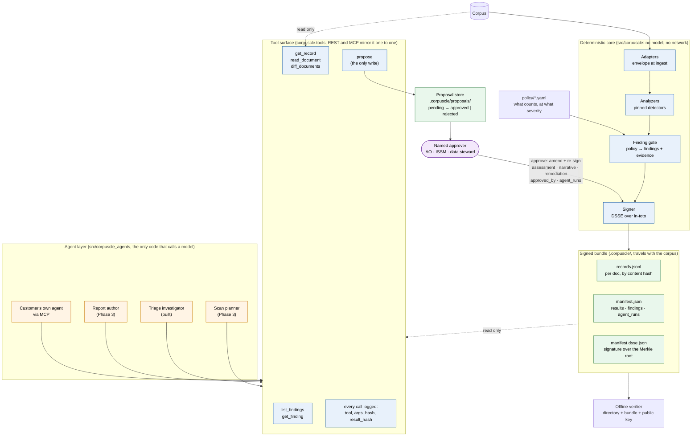

# Architecture

Two halves with a hard line between them. Below the line, a deterministic core measures, gates and
signs, and never calls a model. Above it, agents investigate and propose through a logged tool
surface, and nothing they propose takes effect until a named person approves it. The signed bundle
is the only artifact that leaves the core, and it records both halves: the numbers, and every tool
call the agents made.

## Components and the trust boundary



What the boundary guarantees:

| The agent can | The agent cannot |
|---|---|
| Read any finding, record and document | Change an observed value, threshold, status or severity |
| Diff documents, follow evidence, decide what to look at | Write to the bundle |
| Propose an assessment, narrative and remediation | Approve its own proposal |
| Be any model, including the customer's own agent over MCP | Act unlogged: every call is hashed into `agent_runs` |

## The triage flow, end to end

```mermaid
sequenceDiagram
    autonumber
    participant Core as Deterministic core
    participant Bundle as Signed bundle
    participant Agent as Triage investigator
    participant Tools as Tool surface (logged)
    participant Store as Proposal store
    participant Human as Named approver
    participant Verifier as Offline verifier

    Core->>Core: measure (dup.near_rate = 0.2857)
    Core->>Core: gate: DUP-002 fail, high, 4 evidence hashes
    Core->>Bundle: sign manifest (findings, results, pins, policy hash)

    Human->>Agent: corpuscle triage --finding DUP-002
    Agent->>Tools: get_finding(DUP-002)
    Tools-->>Agent: finding + evidence hashes
    Agent->>Tools: diff_documents(a, b)
    Tools-->>Agent: similarity 0.99, one word changed
    Agent->>Tools: get_record(a)
    Tools-->>Agent: envelope, metrics, flags (no text)
    Agent->>Tools: propose(real, narrative, remediation, evidence)
    Tools->>Store: proposal + agent_run (every call hashed)
    Note over Bundle: nothing has changed

    Human->>Store: corpuscle approve prop-… --approver "Dana Reyes, ISSM" --key …
    Store->>Core: checks: finding exists, gate judged it, not already approved
    Core->>Bundle: amend finding (assessment, narrative, remediation, approved_by)
    Core->>Bundle: append agent_run; re-sign
    Note over Bundle: observed, threshold, status, severity, records, Merkle root: unchanged

    Verifier->>Bundle: verify offline
    Bundle-->>Verifier: signature, records hash, Merkle root, files: PASS
```

## Why it is built this way

- **Agents propose, the core disposes.** A model's judgement is not reproducible or signable. Its
  investigation is valuable, so it is recorded and signed as what it is: an agent run with a
  conclusion, approved by a person, beside numbers that did not move.
- **The objection this answers.** "The model will take care of data quality." Yes: bring the model.
  The question the authorizing official asks afterwards is what the model looked at, what it
  concluded, and who agreed. The manifest answers all three.
- **Bring your own agent.** The tool surface is the product boundary, not our agent. A customer's
  agent over MCP gets the same six calls, the same log, and the same approval gate.
