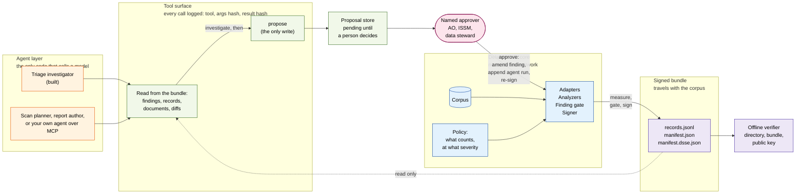
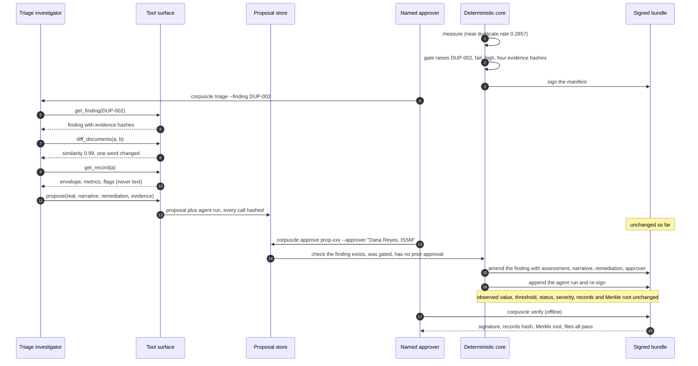

# Architecture

Two halves with a hard line between them. Below the line, a deterministic core measures, gates and
signs, and never calls a model. Above it, agents investigate and propose through a logged tool
surface, and nothing they propose takes effect until a named person approves it. The signed bundle
is the only artifact that leaves the core, and it records both halves: the numbers, and every tool
call the agents made.

## Layers and the trust boundary

Read left to right. The agent layer is the only code that calls a model; the core never does.
The only way anything from the top reaches the signer is through a named person, and the
agents read the bundle only through the tool surface, which logs every call.

What the boundary guarantees:

| The agent can | The agent cannot |
|---|---|
| Read any finding, record and document | Change an observed value, threshold, status or severity |
| Diff documents, follow evidence, decide what to look at | Write to the bundle |
| Propose an assessment, narrative and remediation | Approve its own proposal |
| Be any model, including the customer's own agent over MCP | Act unlogged: every call is hashed into `agent_runs` |

## The triage flow, end to end

## Why it is built this way

- **Agents propose, the core disposes.** A model's judgement is not reproducible or signable. Its
  investigation is valuable, so it is recorded and signed as what it is: an agent run with a
  conclusion, approved by a person, beside numbers that did not move.
- **The objection this answers.** "The model will take care of data quality." Yes: bring the model.
  The question the authorizing official asks afterwards is what the model looked at, what it
  concluded, and who agreed. The manifest answers all three.
- **Bring your own agent.** The tool surface is the product boundary, not our agent. A customer's
  agent over MCP gets the same six calls, the same log, and the same approval gate.
